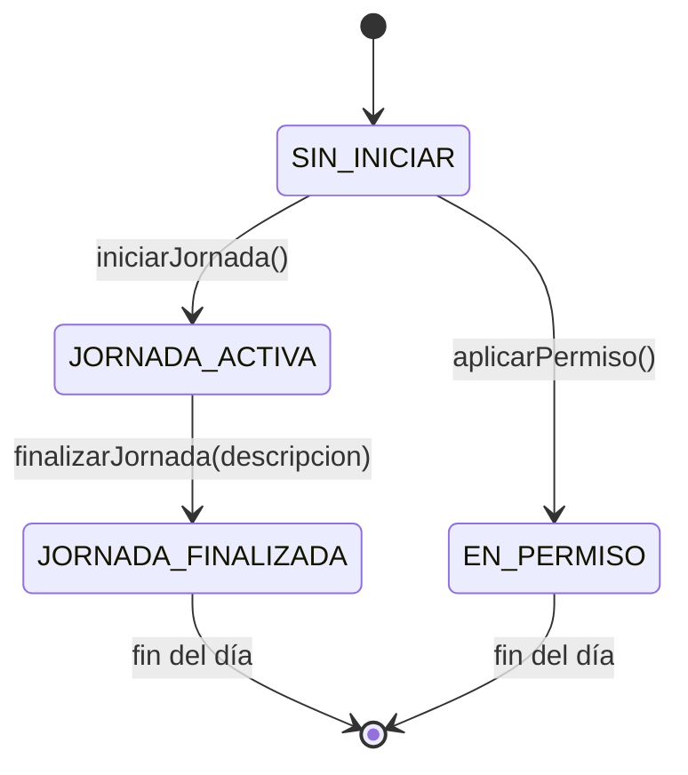

# Máquina de Estados — Jornada Laboral (Patrón State)

> Documento complementario de `REQUIREMENTS.md` sección 11. Este es el detalle formal de la máquina de estados que implementa el patrón **State** en backend, con espejo de solo-lectura en frontend.

**Alcance de la máquina:** un registro de `registro_jornada` (ver `DATABASE_SCHEMA.md`), es decir, **por usuario y por día**.

---

## 1. Estados

| Estado | Significado |
|---|---|
| `SIN_INICIAR` | El usuario no ha fichado entrada en el día actual |
| `JORNADA_ACTIVA` | Ya fichó entrada, aún no ha fichado salida |
| `JORNADA_FINALIZADA` | Fichó entrada y salida, con descripción de proyectos registrada |
| `EN_PERMISO` | El día está cubierto total o parcialmente por un permiso (a partir de Fase 3) |

> **Decisión confirmada:** no habrá cierre automático de jornada. Si un empleado no ficha salida, el registro permanece en `JORNADA_ACTIVA` indefinidamente hasta que él (o un administrador) lo cierre manualmente con `finalizarJornada()`. No existe job/cron de medianoche ni estado `JORNADA_INCOMPLETA`.

## 2. Diagrama de transiciones



Cada día calendario nuevo crea un registro nuevo que **inicia en `SIN_INICIAR`**, con la excepción de que si el usuario tiene una jornada del día anterior aún `JORNADA_ACTIVA` (no cerrada), esa jornada sigue existiendo y activa hasta que se cierre — ver caso 3.1.

---

## 3. Casos borde y su manejo

### 3.1 Jornada que cruza la medianoche o queda abierta varios días
**Decisión:** no hay cierre automático. La jornada permanece `JORNADA_ACTIVA` hasta que el empleado (o un administrador, en su representación) presione "Finalizar jornada" explícitamente, sin importar cuánto tiempo haya pasado.
- El registro (`registro_jornada`) queda **asociado a la fecha de inicio** (`fecha` = fecha de `hora_inicio`), aunque `hora_fin` caiga en un día calendario distinto.
- El cálculo de horas ordinarias/extra/nocturnas se hace sobre el rango real `hora_inicio → hora_fin`, franjeando correctamente por hora (ej. horas antes de medianoche se evalúan contra el recargo nocturno de ese día, horas después de medianoche igual, aunque pertenezcan a la fecha siguiente).
- Como el índice único es `(usuario_id, fecha)` sobre la fecha de inicio, el empleado **sí puede iniciar una nueva jornada al día siguiente** aunque la anterior siga abierta — esto es intencional (evita bloquear al empleado por un olvido), pero implica que puede haber más de una jornada `JORNADA_ACTIVA` simultánea para el mismo usuario. El frontend debe mostrar todas las jornadas activas pendientes de cierre, no solo "la de hoy".
- Al no haber corrección automática, cualquier ajuste posterior de horas se hace por edición manual normal (sección 5.2 / `PUT /attendance/:id`), quedando auditado igual que cualquier otra edición.

### 3.2 Doble clic / doble intento de iniciar jornada
El backend valida de forma atómica (transacción + constraint `UNIQUE (usuario_id, fecha)` cuando aplica, o verificación de estado antes de insertar) que no exista ya un registro `JORNADA_ACTIVA` para ese usuario/fecha. Si existe, responde `409 JORNADA_YA_ACTIVA` (ver `API_CONTRACTS.md`). El frontend, al recibir este error, simplemente refresca el estado desde `GET /attendance/today` en lugar de asumir éxito.

### 3.3 Finalizar sin haber iniciado
Rechazado con `409 NO_HAY_JORNADA_ACTIVA`. Este caso en la práctica no debería ser alcanzable desde la UI si el frontend respeta el estado recibido del backend (el botón "Finalizar" no se muestra en `SIN_INICIAR`), pero el backend **igual debe validarlo** porque no se confía en el cliente.

### 3.4 Trabajar en día festivo o fin de semana
No es un estado distinto — el empleado puede iniciar/finalizar jornada normalmente en `SIN_INICIAR → JORNADA_ACTIVA → JORNADA_FINALIZADA` cualquier día. Lo que cambia es el **cálculo de horas** (motor de reglas de la sección 3 de `REQUIREMENTS.md`), que consulta la tabla `festivos` y el día de la semana para aplicar el recargo dominical/festivo (+90%) en lugar del ordinario. Esto es responsabilidad del cálculo de horas, no de la máquina de estados.

### 3.5 Permiso solicitado para un día que ya tiene jornada activa o finalizada
Regla propuesta (a confirmar con el módulo de permisos en Fase 3): un permiso no puede solicitarse para un día que ya está en `JORNADA_ACTIVA` o `JORNADA_FINALIZADA` sin que el empleado o un administrador reconcilien manualmente las horas, porque un permiso "Completo" implicaría horas que ya fueron trabajadas. Se sugiere: si el día tiene horas ya registradas, el sistema advierte y solo permite permisos `PARCIAL` que no excedan las horas restantes del día.

### 3.6 Cambio de las variables de sistema (ej. `horasMinimasSemanales`) a mitad de una jornada activa
No afecta la máquina de estados. El cálculo de horas siempre usa el valor de `configuracion_sistema` **vigente en la fecha del registro**, no el vigente al momento de calcular, gracias al versionamiento (sección 2 de `DATABASE_SCHEMA.md`). Esto evita que un cambio de parámetro "recalcule" mal jornadas pasadas.

---

## 4. Implementación (referencia de patrón)

**Backend (ejemplo conceptual, no código final):**
```
interface JornadaState {
  iniciar(contexto): Resultado
  finalizar(contexto, descripcion): Resultado
  aplicarPermiso(contexto): Resultado
}

class SinIniciarState implements JornadaState { ... permite iniciar() ... }
class JornadaActivaState implements JornadaState { ... permite finalizar() ... }
class JornadaFinalizadaState implements JornadaState { ... rechaza todo ... }
```
La entidad `RegistroJornada` delega en la instancia de estado actual (`this.state.iniciar(...)`, etc.) en vez de tener `switch/if` sobre un campo string disperso en los servicios — esto es lo que cumple **Open/Closed**: agregar `EN_PERMISO` en Fase 3 no requiere tocar las clases de estado existentes, solo agregar `PermisoState` e implementar sus transiciones válidas.

**Frontend:** el hook `useJornadaState()` (mencionado en `REQUIREMENTS.md` 11.4) simplemente mapea el string de estado recibido a qué botones/formularios mostrar — es una tabla de presentación, no una réplica de la lógica de transición.

---

## 5. Manejo de fecha y hora

- La hora de inicio/fin de jornada **siempre se toma del reloj del servidor**, nunca del cliente, para evitar manipulación.
- Zona horaria de referencia: **`America/Bogota`**.
- Formato de visualización en toda la UI: **24 horas** (ej. `19:00`, no `7:00 PM`).
- Almacenamiento interno: `TIMESTAMPTZ` en UTC (estándar de PostgreSQL); la conversión a `America/Bogota` y el formato 24h se aplican en la capa de presentación (API/frontend), nunca alterando el dato crudo almacenado.

## 6. Pendientes de este documento
- [ ] Confirmar con el módulo de permisos (Fase 3) la interacción exacta descrita en 3.5 antes de implementarla.
